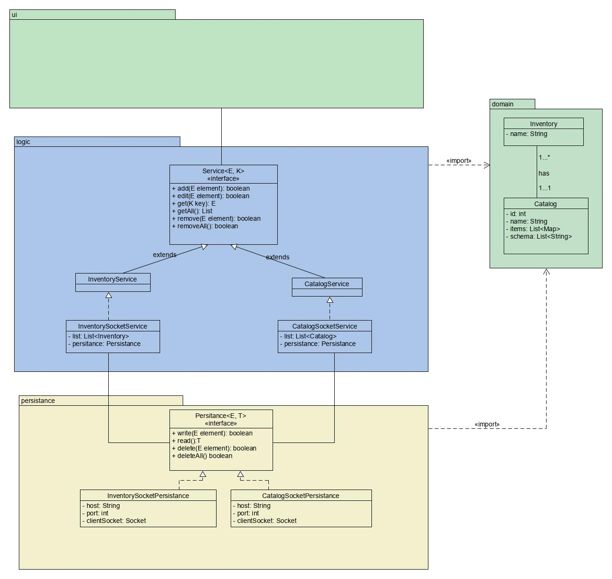
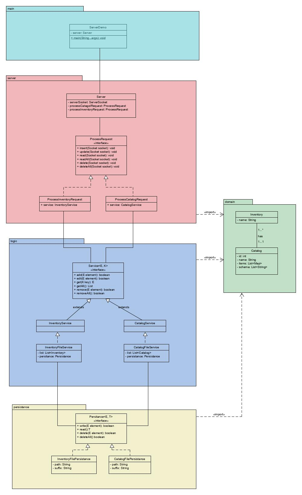

# UML Class Diagrams

## Client Class Diagram
---
Las clases **InventorySocketService** y **CatalogSocketService**, se utilizarán en el UI, para realizar las acciones de CRUD. Tras pasar esta capa, el objecto se enviará a las clases **InventorySocketPersistance** o **CatalogSocketPersistance**, las cuales se conectan con el Servidor y genera peticiones de tipo CatalogRequest o InventoryRequest, según sea la implementación.  

## Server Class Diagram
El servidor recibirá y clasificará peticiones de tipo **InventoryRequest** o **CatalogRequest**. Luego se enviará su contenido (ya sea un catálogo o onventario) a su respectivo servicio, los cuales serán **InventoryFileService** o **CatalogFileService** para realizar las validaciones de negocio. Si las cumple con los requisitos de negocio las clases **InventoryFilePersistance** y **InventoryFilePersistance**, se encargan de guardar los objectos en un archivo **.json**.

---

